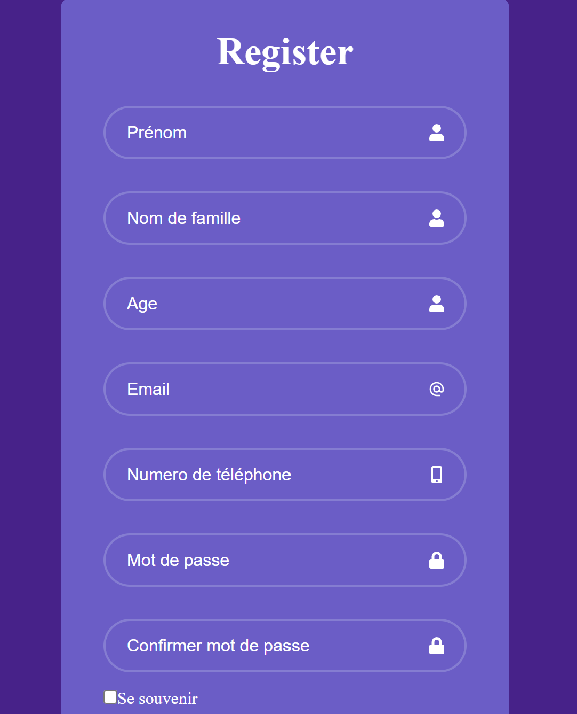

        ✨ Exercice React : Formulaire avec Validation et Affichage des Données Soumises ✨



## ✏️ Description
Ce projet a consisté à créer un formulaire en ReactJS avec des validations dynamiques pour vérifier que les informations saisies respectent les bonnes conditions avant la soumission. Une fois validé, les données saisies sont affichées sous le formulaire pour permettre à l'utilisateur de voir un récapitulatif des informations soumises. Ce projet a été réalisé avec React et Vite, offrant un environnement de développement rapide et moderne pour créer des applications web performantes. Cet exercice permet de maîtriser la gestion de l'état dans React, la validation des formulaires en temps réel, et l'affichage dynamique des données une fois soumises.

## 💻 Technologies utilisées
**ReactJS** : Pour la gestion de l'état et le rendu dynamique du formulaire et des informations soumises.

**Vite** : Un outil de développement rapide pour React, permettant un rechargement instantané et une configuration simplifiée.

**CSS** : Pour la mise en page et le style du formulaire.

**JavaScript** : Pour la logique de validation des champs et la gestion des données soumises.

## Caractéristiques principales 🚀

## 🎯 Formulaire avec validation dynamique 

:Création d'un formulaire avec des validations en temps réel (par exemple, vérifier que l'email est bien formaté, que les champs requis sont remplis, etc.) et affichage des messages d'erreur clairs pour l'utilisateur.

🎨 Affichage des données soumises :
Une fois le formulaire soumis et validé, les informations saisies sont affichées en dessous du formulaire sous forme de récapitulatif, permettant à l'utilisateur de voir ce qu'il a envoyé.

🔄 Réutilisation des composants :
Le projet aurait pu être amélioré en réutilisant davantage de composants React, ce qui aurait permis d'améliorer la modularité et de rendre le code plus facile à maintenir et à étendre pour d'autres formulaires futurs.

📚 Amélioration du code pour la réutilisabilité :
La réutilisation des composants aurait permis de simplifier la gestion des états et de rendre le code plus clair, tout en facilitant les ajouts ou modifications futurs.

🧑‍🏫 Réactivité et expérience utilisateur :
Le formulaire a été conçu pour offrir une expérience fluide et réactive, avec des validations instantanées et une interface utilisateur agréable.
## lien:
[ici](https://formulaire-gilt.vercel.app/)
## 🛠️ Installation & Utilisation
1. Cloner le dépôt :

```
git clone https://github.com/BertrandM22/Formulaire.git
cd reactFormProject
```
2. Installer les dépendances :
```
npm install
```
3. Lancer le projet avec Vite :
```
npm run dev
```

4. Ouvrir le projet :
   
Ouvre le fichier http://localhost:5173 dans ton navigateur préféré pour voir le formulaire en action.
